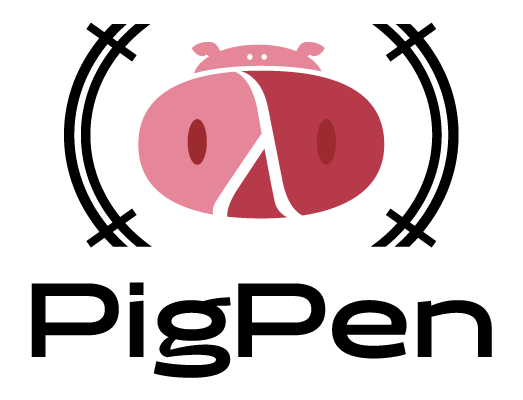

PigPen is map-reduce for Clojure. It compiles to [Apache Pig](http://pig.apache.org/), but you don't need to know much about Pig to use it.

##What is PigPen?

  * A map-reduce language that looks and behaves like clojure.core
  * The ability to write map-reduce queries as programs, not scripts
  * Strong support for unit tests and iterative development

## Really, yet another map-reduce language?

### If you know Clojure, you already know PigPen

The primary goal of PigPen is to take language out of the equation. PigPen operators are designed to be as close as possible to the Clojure equivalents. There are no special user defined functions (UDFs). Define Clojure functions, anonymously or named, and use them like you would in any Clojure program.

Here's the proverbial word count:

``` clj
(require '[pigpen.core :as pig])

(defn word-count [lines]
  (->> lines
    (pig/mapcat #(-> % first
                   (clojure.string/lower-case)
                   (clojure.string/replace #"[^\w\s]" "")
                   (clojure.string/split #"\s+")))
    (pig/group-by identity)
    (pig/map (fn [[word occurrences]] [word (count occurrences)]))))
```

This defines a function that returns a PigPen query expression. The query takes a sequence of lines and returns the frequency that each word appears. As you can see, this is just the word count logic. We don't have to conflate external concerns, like where our data is coming from or going to.


## Will it compose?

Yep - PigPen queries are written as function compositions - data in, data out. Write it once and avoid the copy & paste routine.

Here we use our word-count function (defined above), along with a load and store command, to make a PigPen query:

``` clj
(defn word-count-query [input output]
  (->>
    (pig/load-tsv input)
    (word-count)
    (pig/store-tsv output)))
```

This function returns the PigPen representation of the query. By itself, it won't do anything - we have to execute it locally or generate a script (more on that later).

## You like unit tests? Yeah, we do that

With PigPen, you can mock input data and write a unit test for your query. No more crossing your fingers & wondering what will happen when you submit to the cluster. No more separate files for test input & output.

Mocking data is really easy. With [`pig/return`](http://netflix.github.io/PigPen/pigpen.core.html#var-return) and [`pig/constantly`](http://netflix.github.io/PigPen/pigpen.core.html#var-constantly), you can inject arbitrary data as a starting point for your script.

A common pattern is to use [`pig/take`](http://netflix.github.io/PigPen/pigpen.core.html#var-take) to sample a few rows of the actual source data. Wrap the result with [`pig/return`](http://netflix.github.io/PigPen/pigpen.core.html#var-return) and you've got mock data.

``` clj
(use 'clojure.test)

(deftest test-word-count
  (let [data (pig/return [["The fox jumped over the dog."]
                          ["The cow jumped over the moon."]])]
    (is (= (pig/dump (word-count data))
           [["moon" 1] ["jumped" 2] ["dog" 1] ["over" 2] ["cow" 1] ["fox" 1] ["the" 4]]))))
```

The [`pig/dump`](http://netflix.github.io/PigPen/pigpen.core.html#var-dump) operator runs the query locally.

## Closures (yes, the kind with an S)

Parameterizing your query is trivial. Any in-scope function parameters or let bindings are available to use in functions.

``` clj
(defn reusable-fn [lower-bound data]
  (let [upper-bound (+ lower-bound 10)]
    (pig/filter (fn [x] (< lower-bound x upper-bound)) data)))
```

Note that `lower-bound` and `upper-bound` are present when we generate the script, and are made available when the function is executed within the cluster.

_Note: To exclude a local variable, add the metadata ^:local to the declaration._

## So how do I use it?

Just tell PigPen where to write the query as a Pig script:

``` clj
(pig/write-script "word-count.pig" (word-count-query "input.tsv" "output.tsv"))
```

And then you have a Pig script which you can submit to your cluster. The script uses `pigpen.jar`, an uberjar with all of the dependencies, so make sure that is submitted with it. Another option is to build an uberjar for your project and submit that instead. Just rename it prior to submission. Check out the tutorial for how to build an uberjar.

As you saw before, we can also use [`pig/dump`](http://netflix.github.io/PigPen/pigpen.core.html#var-dump) to run the query locally and return Clojure data:

``` clj
=> (def data (pig/return [["The fox jumped over the dog."]
                          ["The cow jumped over the moon."]]))
#'pigpen-demo/data

=> (pig/dump (word-count data))
[["moon" 1] ["jumped" 2] ["dog" 1] ["over" 2] ["cow" 1] ["fox" 1] ["the" 4]]
```

# Getting started

Getting started with Clojure and PigPen is really easy. Just follow the steps below to get up and running.

  1. Install [Leiningen](https://github.com/technomancy/leiningen#leiningen)
  2. Create a new leiningen project with `lein new pigpen-demo`
  3. Add PigPen as a dependency by adding `[com.netflix.pigpen/pigpen "0.1"]` into your project's `project.clj` file.
  4. Run `lein repl` to start a REPL for your new project.
  5. Try some samples in the [tutorial](Tutorial.md)

_Note: If you are not familiar at all with [Clojure](http://clojure.org/), I strongly recommend that you try a tutorial [here](http://tryclj.com/), [here](http://java.ociweb.com/mark/clojure/article.html), or [here](http://learn-clojure.com/) to understand some of the [basics](http://clojure.org/cheatsheet)._

_Note: PigPen is **not** a Clojure wrapper for writing Pig scripts you can hand edit. While it's entirely possible, the resulting scripts are not intended for human consumption._

# Tutorials & Documentation

There are three distinct audiences for PigPen, so we wrote three different tutorials:

  * Those coming from the Clojure community who want to do map-reduce: [PigPen for Clojure users](README-for-Clojure-Users.md)
  * Those coming from the Pig community who want to use Clojure: [PigPen for Pig users](README-for-Pig-Users.md)
  * And a general tutorial for anybody wanting to learn it all: [PigPen Tutorial](Tutorial.md)

If you know both Clojure and Pig, you'll probably find all of the tutorials interesting.

The full API documentation is located [here](http://netflix.github.io/PigPen/pigpen.core.html)

## Artifacts

`pigpen` is available from Maven:

With Leiningen:

``` clj
[com.netflix.pigpen/pigpen "0.1"]
```

With Maven:

``` xml
<dependency>
  <groupId>com.netflix.pigpen</groupId>
  <artifactId>pigpen</artifactId>
  <version>0.1</version>
</dependency>
```
